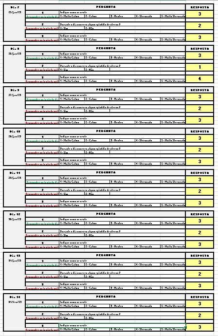
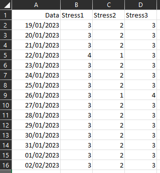
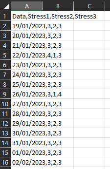
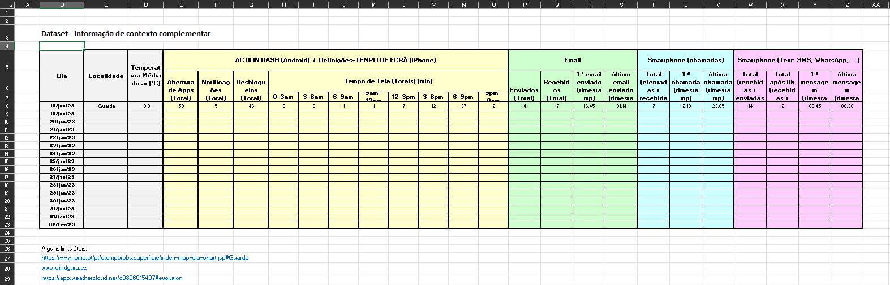
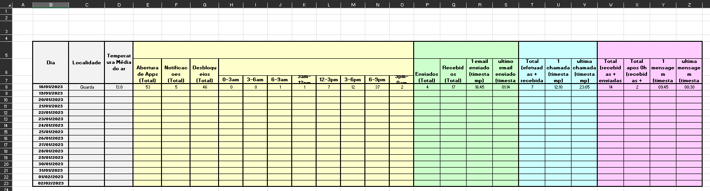
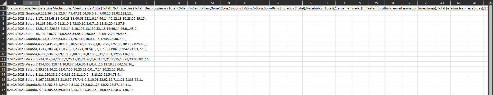
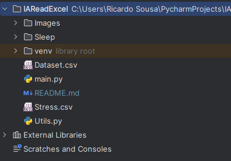
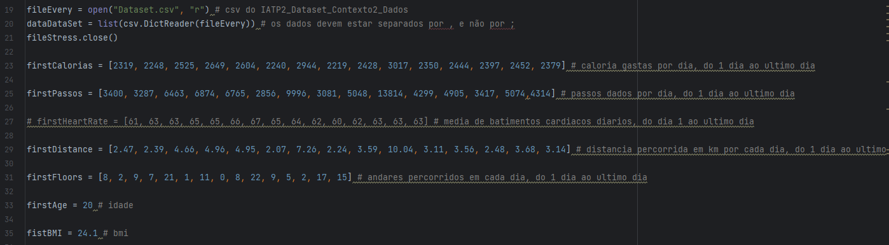
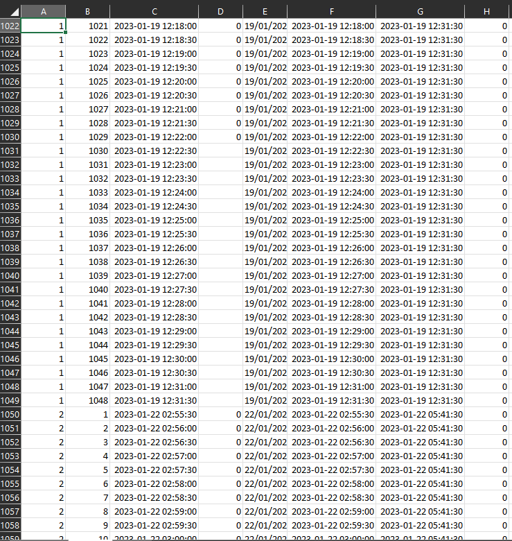
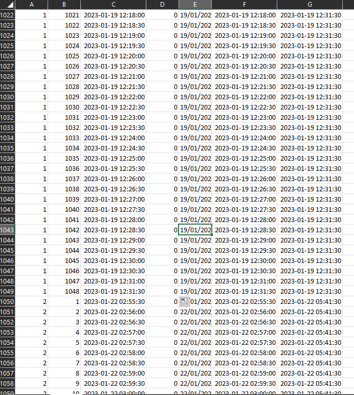

# Título do Projeto

Uma breve descrição sobre o que esse projeto faz e para quem ele é

# IAReadExcel

## Instruções de uso:
- 1º passo, colocar os dados do ficheiro IATP2_Dataset_Contexto1_Dados.xlsx(ficheiro dado pelo professor) num novo ficheiro excel com as colunas Data, Stress1, Stress2, Stress3 e guardar como .csv 
 
Ficheiro xlsx: 
 
Resultado(ficheiro .csv) 
 
- 2º passo, reformatar o ficheiro IATP2_Dataset_Contexto1_Dados.xlsx(ficheiro dado pelo professor) de modo a ficar como na imagem abaixo, removendo também a pontuação das palavras e reformar de 1.º para penas 1 e convertendo as datas para o formato dd/mm/yyyy 
 
Ficheiro xlsx: 
 
Resultado(ficheiro .csv) 
 
- 3º passo, colocar os ficheiros .csv anteriores na pasta do projeto do pycharm

- 4º passo, colocar a pasta sleep, que se encontra no Dataset proveniente da Fitbit na pasta do projeto do pycharm 
 
- 5º passo, abrir os ficheiros .csv dentro do pycharm ou com o notepad++/editor de texto do windows e alterar as separações dos ficheiros de ; para ,

- 6º passo, preencher as listas firstCalorias(calorias gastas por dia), firstPassos(passos dados por dia), firstDistance(diastancia percorrida por dia(km)), firstFloors(andares por dia), firstAge(idade) e fistBMI(BMI) com os dados da aplicação Fitbit do 1º dia para o último 
 
- 7º passo, trocar o nome do ficheiro fSleep para o nome do ficheiro json presente na pasta Sleep

- 8º passo, executar o programa e aguardar pela mensagem "Dataset final gerado."

- 9º passo, abrir o Final_Dataset.xlsx e preencher os espaços em branco da coluna Sleep_Stage com o último sleep stage desse dia 
 
Resultado final: 
 
- 10º passo, gerar o ficheiro .csv a partir do Final_Dataset.xlsx
